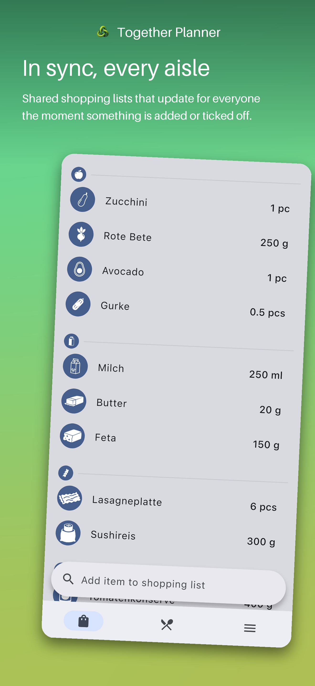
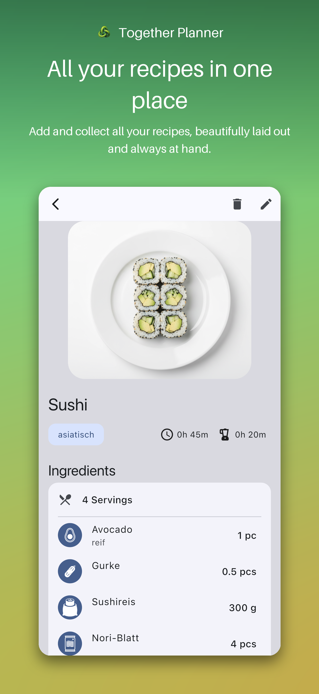

# Together Planner

**Plan your recipes, chores and appointments, together.**

A shared planning app for couples, families and roommates. Recipes, meal plan
and shopping list, kept in sync for everyone in the group.

## Features

- **🛒 Shared shopping list:** one list for the group, updating in real time and grouped by category.
- **🍳 Recipes & meal plan:** collect recipes, plan the week's dinners together, and send ingredients to the list in a tap.
- **📖 Detailed recipes:** ingredients, servings and prep/cook times; scale servings and quantities adjust.
- **👥 Flexible groups:** invite people with a link, pick which features each group uses, and control permissions.

## Roadmap

Designed and on the way, each toggleable per group:

- [ ] **To-Do's:** split chores and tasks across the group
- [ ] **Calendar:** keep shared events and appointments in one place
- [ ] **Money Splitting:** track and split shared expenses
