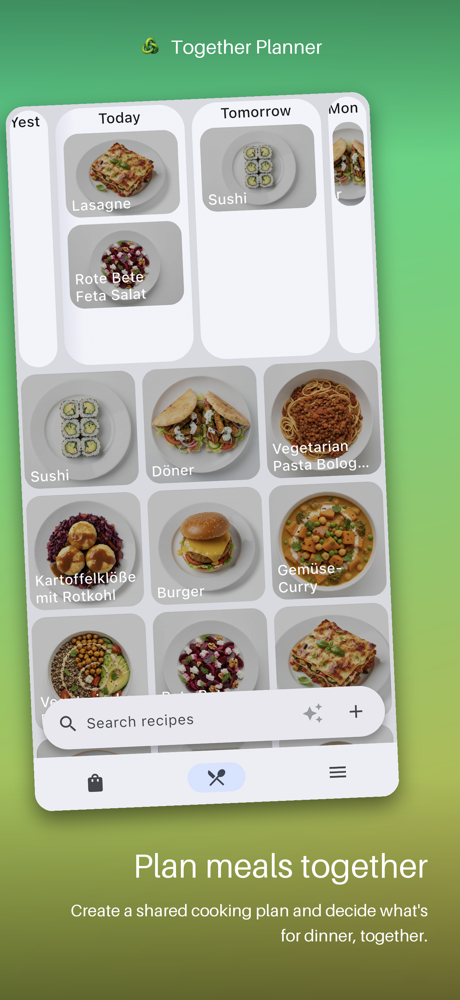

  

  

    <h3>🛒 Shopping List</h3>
    
Add an item and it appears on everyone's phone instantly. Tick things off while shopping and the list stays in sync, grouped by category.

  

  

  

    <h3>🍳 Recipes &amp; Meal Plan</h3>
    
Save your recipes and plan meals together. Add ingredients straight to the shopping list with one tap.

  

  

  

    <h3>📖 Every Recipe at Hand</h3>
    
Ingredients, times and servings — always at hand. Scale a recipe and quantities adjust automatically.

  

## On the roadmap

  

    ✅<strong>To-Do's</strong> — split chores and tasks with your group.coming soon
  

  

    📅<strong>Calendar</strong> — shared events and appointments in one place.coming soon
  

  

    💸<strong>Money Splitting</strong> — track and split shared expenses fairly.coming soon
  

## Support &amp; Questions

Need help using the app or have a general question?
[Email our Support Team](mailto:equirinya@gmail.com?subject=Together%20Planner%20Support%20Question)

---
[Privacy Policy](./privacy.md) | [Terms and Conditions](./terms.md) | [Delete Account Data](./delete-account.md)
